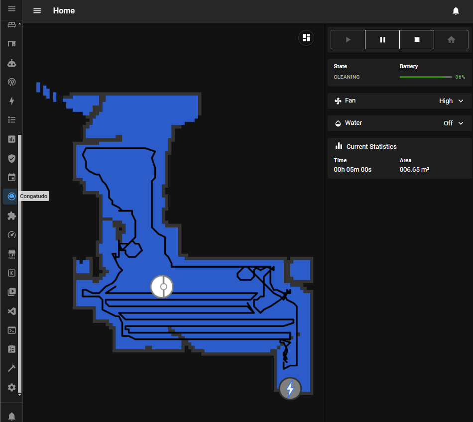
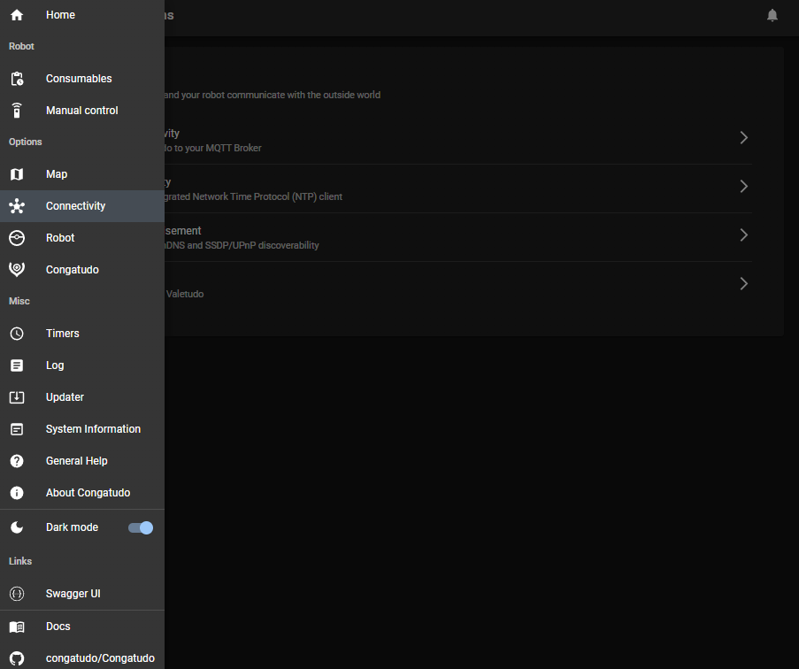
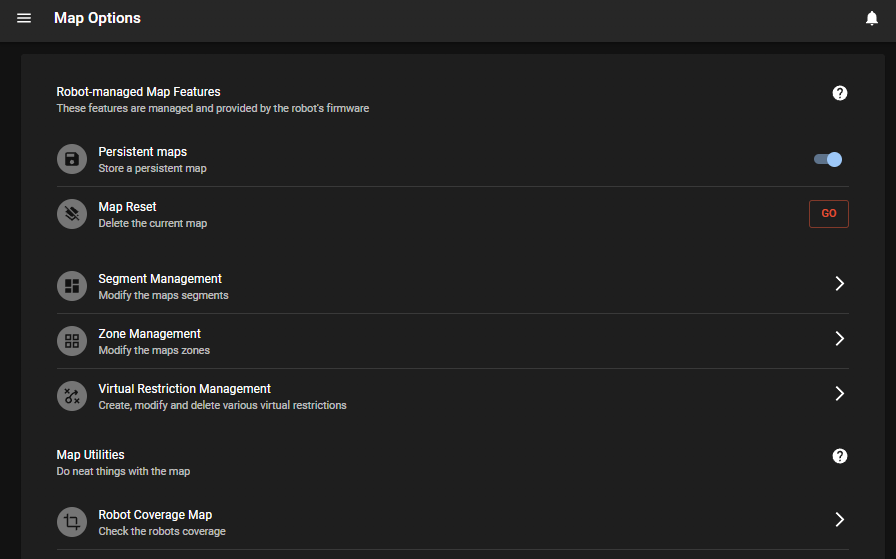

<div align="center">
    
    <p align="center"><h2>Free your vacuum from the cloud</h2></p>
</div>

 [Congatudo](https://github.com/congatudo/Congatudo) add-on aims to be a vendor-agnostic abstraction and cloud replacement for Cecotec Conga vacuum robots
For more information, check out the [repository](https://github.com/congatudo/Congatudo)


## Table of Contents

1. [Prerequisites](#1-prerequisites)
2. [How it Works](#2-how-it-works)
3. [Installation](#3-installation)
4. [Connect your robot](#4-connect-your-robot)
5. [Beta Add-on for Multiple Robots](#5-beta-addon-for-multiple-robots)
6. [Navigate and Edit sysConfig.ini](#6-navigate-and-edit-sysconfigini)
7. [Expected Log Output](#7-expected-log-output)
8. [Running Multiple Instances](#8-running-multiple-instances)
9. [Screenshots](#9-screenshots)
10. [Resources](#10-resources)


##
## **1. Prerequisites**
- Basic knowledge of the Congatudo project.
- Root access to your Conga robot via [SSH or ADB](https://github.com/congatudo/Congatudo/tree/master#get-root-access-in-your-conga).
- A Windows computer (anything from the last 15 years is good enough.)
- Have already installed and running a MQTT server resource. (preferably Mosquitto broker addon)
This add-on is automatically configured if you have a MQTT service in Home Assistant.
- A little knowlege of Linux systems will help.
##  
## **2. How it Works**
- The add-on adds a file named `valetudo.json` in the `/config` directory of your HA installation.
- One instance of the add-on will control a single robot.
- You can install both the main add-on and the beta add-on simultaneously.
- Each addon will operate independently, allowing you to integrate multiple Conga robots into Home Assistant.

##
## **3. Installation**

1. Click the button below to install this repository:
2. Click on the new addon named "Congatudo".
3. Click `Install` on the addon page.
4. Click `Start` and then `Open Web UI` to confirm everything is ok.
5. Configure your Conga robot's credentials and network parameters.

[](https://my.home-assistant.io/redirect/supervisor_add_addon_repository/?repository_url=https://github.com/congatudo/congatudo-add-on)


##
## **4. Connect your robot**

Now you need to connect your robot to your addon.

1. Ensure your Conga is connected to your WiFi
2. Access your Conga through SSH (follow this instruction to overpass the root password [here](https://github.com/congatudo/stuff/blob/master/docs/rooting-conga.md))
3. Edit the hosts file in the robot with your home assistant ip and reboot:

 ⚠️**You must replace `YOUR_HOMEASSISTANT_IP` with the IP address of your own HA server. (e.g., `192.168.1.10`).**
  
  ```bash
echo "YOUR_HOMEASSISTANT_IP cecotec.das.3irobotix.net cecotec.download.3irobotix.net cecotec.log.3irobotix.net cecotec.ota.3irobotix.net eu.das.3irobotics.net eu.log.3irobotics.net eu.ota.3irobotics.net cecotec-das.3irobotix.net cecotec-log.3irobotix.net cecotec-upgrade.3irobotix.net cecotec-download.3irobotix.net" >> /etc/hosts
```


5.  Restart the robot:
   ```bash
   reboot
   ```


5. Check the add-on logs to see if the robot is registered and you are done.
   - Enable `Show in sidebar`.
   - Click `Start` to start the addon.

6. 🎉 At this point you have sucessfully set up the HA addon and robot and you should be all done!.

##
##
## **5. Beta Addon for Multiple Robots**

If you have more than one Conga robot and need to control each one independently, you can use the beta add-on. This allows you to install a second instances of the add-on, with each instance controlling a separate robot.

1. Search for the CongaTudo Beta add-on in the Add-on Store.
2. Install the beta add-on.
3. Configure the addon with the paramaters of your second Conga robot if needed:
   - `server_cmd_port=4011`
   - `server_map_port=4031`
   - `server_sync_time_port=4051`
4. In the **Info** tab:
   - Enable `Show in sidebar`.
   - Click `Start` to start the addon.

5. Now you have to configure the conga robot before you can use the beta addon.

##
## **6. Navigate and Edit `sysConfig.ini`**

Instead of manually editing `/etc/config/sysConfig.ini` with `vi`, you can quickly and safely modify the necessary lines using `sed` commands over SSH. This approach is easier and reduces the chance of mistakes.


1. Access the Device via SSH:

   - Open PuTTY (or your preferred SSH client) on your computer.
   - Connect to your device using its IP address and login credentials.

2. Backup the Configuration File:

   Before making any changes, it's a good idea to create a backup of the current `sysConfig.ini` file:

   ```sh
   cp /etc/config/sysConfig.ini /etc/config/sysConfig.ini.bak
   ```

3. Review the Current Configuration:

   You can view the current contents of the file to ensure it matches your expectations:

   ```sh
   cat /etc/config/sysConfig.ini
   ```
   It should look like this or very similar with minor valeu diffrences:
   ```ini
   [Sys_Config]
   server_cmd_address=cecotec.das.3irobotix.net
   server_map_address=cecotec.das.3irobotix.net
   server_log_address=cecotec.log.3irobotix.net
   server_ota_address=cecotec.ota.3irobotix.net
   server_down_address=cecotec.download.3irobotix.net
   server_ssl_cmd_port=5010
   server_ssl_map_port=5030
   server_ssl_enable=0
   server_cmd_port=4010
   server_map_port=4030
   server_sync_time_port=4050
   server_log_port=21
   server_ota_check_port=5000
   server_ota_download_port=2300
   wlan_port=8111
   wlan_broad_port=8888
   deviceFirmsID=1003
   deviceType=20
   languageType=2
   hardwareRtc=1
   timezoneSec=28800
   ctrl_version=V4.0

   ```
    

5. Run the Following Commands to Edit the Configuration:
   - These commands will replace the server addresses and ports with the values you need. Note that the `YOUR_HOMEASSISTANT_IP` is an example representing a HomeAssistant server IP address.
   - ⚠️**You must replace `YOUR_HOMEASSISTANT_IP` with the IP address of your own HA server. (e.g., `192.168.1.10`).**

   ```sh

   sed -i \
    -e 's/^server_cmd_address=.*/server_cmd_address=YOUR_HOMEASSISTANT_IP/' \
    -e 's/^server_map_address=.*/server_map_address=YOUR_HOMEASSISTANT_IP/' \
    -e 's/^server_log_address=.*/server_log_address=YOUR_HOMEASSISTANT_IP/' \
    -e 's/^server_ota_address=.*/server_ota_address=YOUR_HOMEASSISTANT_IP/' \
    -e 's/^server_down_address=.*/server_down_address=YOUR_HOMEASSISTANT_IP/' \
    -e 's/^server_cmd_port=.*/server_cmd_port=4011/' \
    -e 's/^server_map_port=.*/server_map_port=4031/' \
    -e 's/^server_sync_time_port=.*/server_sync_time_port=4051/' \
    /etc/config/sysConfig.ini

   ```

7. Verify the Changes:

   After running the commands, you can check the modified file:

   ```sh
   cat /etc/config/sysConfig.ini
   ```

8. Restart the robot:
   
   ```bash
   reboot
   ```


9. Verify the Configuration after rebooting, SSH back in and verify the file: (Optional)

   ```bash
   cat /etc/config/app.conf
   ```

10. Ensure the new values are there.


##
## **7. Expected Log Output**
If everything was configured correctly, you should see logs similar to the following in the Log tab:
```pgsql
[2023-12-26T16:48:33.108Z] [INFO] Webserver running on port 8080
[2023-12-26T16:48:33.560Z] [INFO] Connected successfully to MQTT broker
[2023-12-26T16:48:34.031Z] [INFO] MQTT configured
[2023-12-26T16:48:34.707Z] [INFO] Added new robot with id 'xxxxx'
```


##
## **8. Running Multiple Instances**
Each add-on will show up as a separate entity in Home Assistant. You can configure and control each one independently.
Example:
- Congatudo Addon: Controls Robot **A**
- Congatudo (beta) Addon: Controls Robot **B**


##
## **9. Screenshots**








[//]: # (### Join the Discussion)

[//]: # ( Oficial Valetudo Telegram group https://t.me/joinchat/RdqOmVgwlck1M2Iy)
[//]: # ( Valetudo Telegram Cecotec Conga group https://t.me/congatudo)

##
## *10. Resources*

* [Congatudo project](https://gitlab.com/congatudo) - Projects under develop for Cecotec Conga vacuum
* [Lovelace Valetudo Map Card](https://github.com/TheLastProject/lovelace-valetudo-map-card) - Map card for Home Assistant
* [I can't believe it's not Valetudo](https://github.com/Hypfer/ICantBelieveItsNotValetudo) - A companion service for PNG Maps
* [Setting up Beta addon using WinSCP on a windows machine](https://github.com/Nismonx/conga-multiple-robots/tree/main) - This guide will help you with the file configuration in your robot using WinSCP
